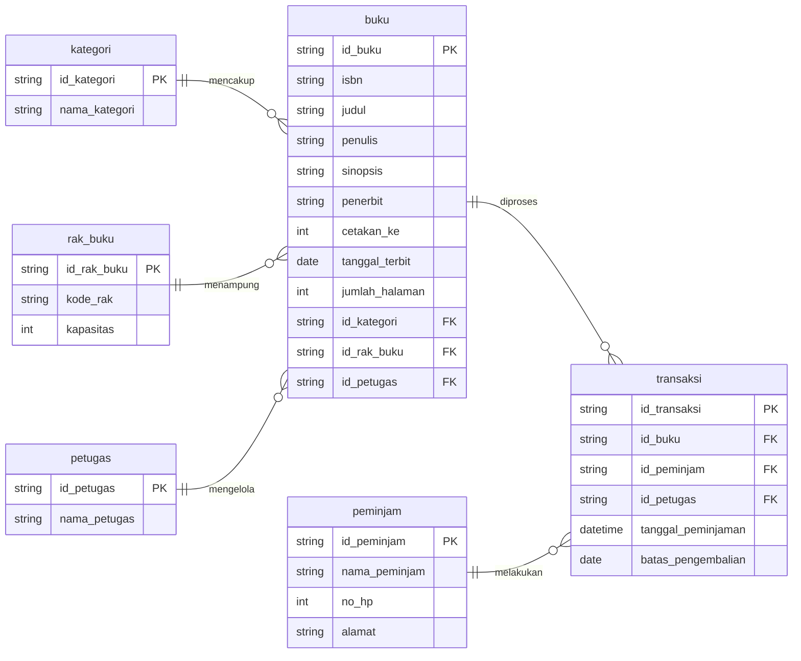

```mermaid
erDiagram
direction LR
    kategori ||--o{ buku : mencakup
    rak_buku ||--o{ buku : menampung
    petugas ||--o{ buku : mengelola
    buku ||--o{ transaksi : diproses
    peminjam ||--o{ transaksi : melakukan

    buku {
        string id_buku PK
        string isbn 
        string judul
        string penulis
        string sinopsis 
        string penerbit
        int cetakan_ke
        date tanggal_terbit
        int jumlah_halaman
        string id_kategori FK
        string id_rak_buku FK
        string id_petugas FK
    }

    kategori {
        string id_kategori PK
        string nama_kategori
    }

    rak_buku {
        string id_rak_buku PK
        string kode_rak
        int kapasitas
    }

    petugas {
        string id_petugas PK
        string nama_petugas
    }

    peminjam {
        string id_peminjam PK
        string nama_peminjam
        int no_hp
        string alamat
    }

    transaksi {
        string id_transaksi PK
        string id_buku FK
        string id_peminjam FK
        string id_petugas FK
        datetime tanggal_peminjaman
        date batas_pengembalian
    }
```
