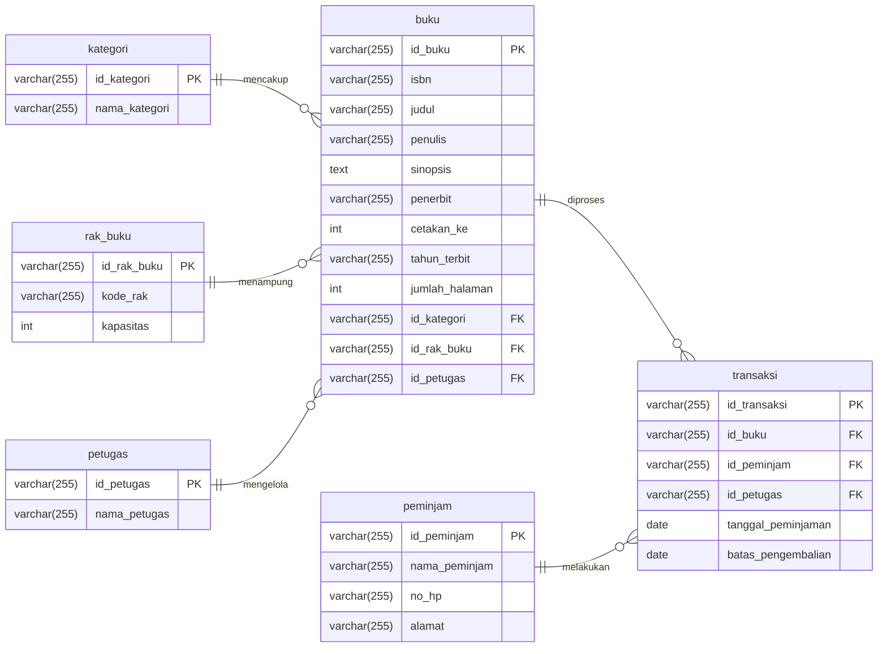

```mermaid
erDiagram
direction LR
    kategori ||--o{ buku : mencakup
    rak_buku ||--o{ buku : menampung
    petugas ||--o{ buku : mengelola
    buku ||--o{ transaksi : diproses
    peminjam ||--o{ transaksi : melakukan

    buku {
        varchar(255) id_buku PK
        varchar(255) isbn 
        varchar(255) judul
        varchar(255) penulis
        text sinopsis 
        varchar(255) penerbit
        int cetakan_ke
        varchar(255) tahun_terbit
        int jumlah_halaman
        varchar(255) id_kategori FK
        varchar(255) id_rak_buku FK
        varchar(255) id_petugas FK
    }

    kategori {
        varchar(255) id_kategori PK
        varchar(255) nama_kategori
    }

    rak_buku {
        varchar(255) id_rak_buku PK
        varchar(255) kode_rak
        int kapasitas
    }

    petugas {
        varchar(255) id_petugas PK
        varchar(255) nama_petugas
    }

    peminjam {
        varchar(255) id_peminjam PK
        varchar(255) nama_peminjam
        varchar(255) no_hp
        varchar(255) alamat
    }

    transaksi {
        varchar(255) id_transaksi PK
        varchar(255) id_buku FK
        varchar(255) id_peminjam FK
        varchar(255) id_petugas FK
        date tanggal_peminjaman
        date batas_pengembalian
    }
```
