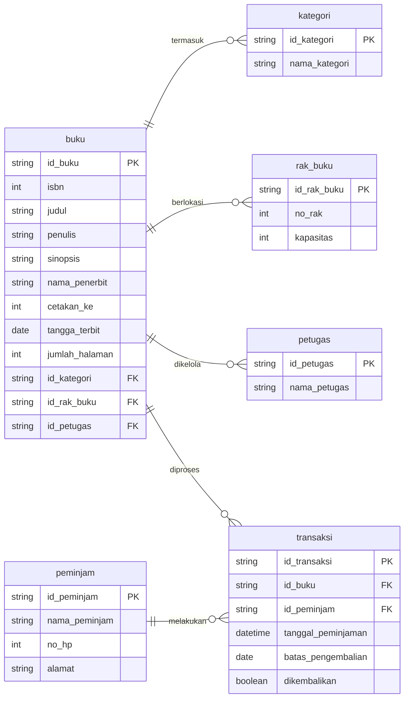

```mermaid
erDiagram
direction LR
    buku ||--o{ kategori : termasuk
    buku ||--o{ rak_buku : berlokasi
    buku ||--o{ petugas : dikelola
    buku ||--o{ transaksi : diproses
    peminjam ||--o{ transaksi : melakukan

    buku {
        string id_buku PK
        int isbn
        string judul
        string penulis
        string sinopsis
        string nama_penerbit
        int cetakan_ke
        date tangga_terbit
        int jumlah_halaman
        string id_kategori FK
        string id_rak_buku FK
        string id_petugas FK
    }

    kategori {
        string id_kategori PK
        string nama_kategori
    }

    rak_buku {
        string id_rak_buku PK
        int no_rak
        int kapasitas
    }

    petugas {
        string id_petugas PK
        string nama_petugas
    }

    peminjam {
        string id_peminjam PK
        string nama_peminjam
        int no_hp
        string alamat
    }

    transaksi {
        string id_transaksi PK
        string id_buku FK
        string id_peminjam FK
        datetime tanggal_peminjaman
        date batas_pengembalian
        boolean dikembalikan
    }
```
